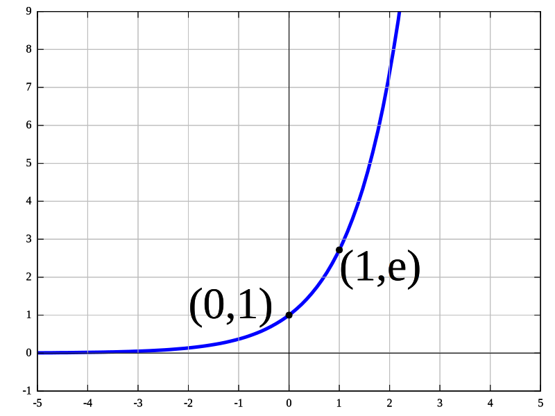

# Funções e Limites

## Funções

Função é a relação binária entre dois conjuntos onde cada elemento do primeiro conjunto é associado a um elemento do segundo conjunto.  

_Desta forma, podemos pensar uma função como uma receita de bolo, onde os ingrediente como a farinha de trigo, os ovos e o açúcar correspondem aos valores de $x$, a receita ou modo de preparo seria a função $f(x)$ em si, e o bolo já pronto seria o elemento final, ou resultado da função. Assim, podemos pensar que $f (farinha,ovo,açúcar) = bolo$ onde $f$ é a receita do bolo._

Então basicamente funções pegam elementos do primeiro conjunto, normalmente chamado de domínio, e retornam elementos que pertencem ao segundo conjunto, chamado de contradomínio, e esses elementos que pertecem ao contradomínio e retornaram da função são chamados de imagem.

Dentre as notações mais usadas para funções temos a associação $y = f(x)$ onde lemos $y$ é igual a função de $x$, representando que o par $(x,y)$ representam os conjuntos de pares que definem a função $f$. E para X sendo o domínio da função temos
$\{(x,f(x))\mid x\in X\}$.

### Funções de primeiro e segundo grau

#### Funções de Primeiro Grau (Função Linear)

Funções Lineares são as funções em que o grafico em coordenadas cartesianas pode ser expresso através de uma linha. Descrita através da função polinomial $f(x)=ax+b$. Sendo considerada de primeira grau pois o $x$ está elevado a primeira potencia. P.S. $x^1 = x$.  

_Por exemplo, um carro com velocidade de $4m/s$ que precisa parar em uma sinaleira e mantém desaceleração constante de $2m/s^2$, tem sua velocidade $v$ representada por $v = 4 - 2t$, sendo $t$ o tempo decorrido em segundos. Logo, sabemos que a velocidade é uma função linear do tempo nesse caso._  

Na imagem acima temos o exemplo da função linear $y(x)=-2x+4$, onde podemos ver no gráfico que cada ponto da reta está posicionado de modo a ter um par de valores $(x,y)$, descrito pela função, comos os pontos $(0,4)$ e $(2,0)$.

#### Funções de Segundo Grau (Função quadrática)

Funções Quadraticas são as funções que possuem a sua variável de maior grau no segundo Grau, tal como a função polimonial, $f(x)=ax^{2}+bx+c,\quad a\neq 0$ que possuem apenas uma variável, e é representada graficamente através de uma parabola como no exemplo a seguir da função $f(x)=2x^{2}-x-2$.

_Fazendo um paralelo com o caso anterior, poderíamos querer representar o espaço $S$ percorrido em função do tempo, ao invés da velocidade. Por exemplo, para saber quantos metros o carro percorreu antes de parar. Para isso, sabemos que $S = So + Vo*t+{\frac {at^2}{2}}$, então $S = 4t - t^2$, já que $So = 0$, $Vo = 4$ e $a = -2$ como se trata de uma desaceleração. Então, sabemos que a posição varia quadráticamente com o tempo nesse caso._

### Domínio, Imagem e continuidade

Como mencionado anteriormente, o domínio de uma função é o conjunto de entradas na função, nos exemplos anteriores são os valores que podemos substituir o $x$ e a imagem da função é justamente o conjunto de saídas, sendo nos exemplos anteriores os valores que encontramos para o $y$ ao substituir o $x$ na função.

Na imagem acima, a área vermelha $X$ representa o dominio, enquanto a amarela $Y$ representa a imagem. Para funções de uma variável, cada membro do domínio estará assocaido a exatamente um membro da imagem. O elemento da imagem pode estar associado a um ou mais membros do domínio.

#### Funções Contínuas

Funções contínuas são aquelas que não possuem mudanças bruscas de valor, vulgo descontinuidades. Sendo preciso, a função é contínua quando uma pequena mudança na saída da função pode ser assegurada através da pequena mudança de sua entrada. Uma forma interessante de visualizar a função contínua é se você consegue desenhar sua função sem precisar tirar a caneta do papel em nenhum momento.

### Tipos de funções

#### Funções polinomiais

São funções que evaluem polinomios. Uma função $f$ será polinomial se dado o domínio ela possa ser expressa através da expressão ${\displaystyle a_{n}x^{n}+a_{n-1}x^{n-1}+\cdots +a_{2}x^{2}+a_{1}x+a_{0}}$, como são os casos das funções de primeiro e segundo grau.

#### Funções Fracionárias

São funções que podem ser presentadas através da fração de duas outras funções, $f(x)={\frac {P(x)}{Q(x)}}$, como o exemplo a seguir, $f(x)={\frac {x^{3}-2x}{2(x^{2}-5)}}$ onde $P(x) = x ^{3} - 2x$ e $Q(x) = 2(x^{2}-5)$ o qual racionando a função $f(x)$ representada pelo grafico abaixo

#### Funções Exponenciais

Funções exponenciais são funções que podem ser expressas através da forma, ${f(x)=ab^{x},}$, como o exemplo da função exponencial $f(x) = e^{x}$.

## Limites

Na matematica limite é o valor que uma função se aproxima quando sua variavel de entrada se aproxima de um determinado valor, normalmente escrita através de $\lim _{x\to c}f(x)=L$ que pode ser lido como, o limite de $f(x)$ quando $x$ tende a $c$ é igual a $L$.

### Conceito de velocidade media e instantanea

Velocidade é a medida usada para determinar quão distante nos movemos ao longo do tempo. Assim se você faz uma viagem de 360km em uma hora, significa que sua velocidade foi de 360 km/h (100m/s), mas em termos pratico isso só diz a media da velocidade que foi realizada, pois se considerarmos um cenario em que você tenha precisado reduzir a velocidade em alguns intervalos, e acelerar em outros, então tendo a distancia total e o tempo total que você precisou temos apenas a velocidade media do percurso.

No caminho de volta você então decidi olhar pro relogio quando chega na metade do caminho e percebe que levou 40 minutos para chegar metade do caminho, o que dá uma velocidade media de 270 km/h, mas acaba percorrendo a outra metade do caminho em 20 minutos, resultando numa velocidade de 540 km/h.

Que mesmo tendo a mesma velocidade media ao total vemos que quando dividimos o intervalo em pedaços cada pedaço possui velocidades diferentes. E conforme os intervalos vão ficando cada vez menores mais eles vão ser proximos do valor mostrado no velocimetro do carro, e quando o intervalo fica tão pequeno quanto um instante temos então a velocidade igual ao do velocimetro, pois o que ele está indicando é examente a velocidade instantanea do carro.

### Noção intuitiva de Limite

O exemplo da velocidade instantanea é um exemplo de limite, pois embora pela definição de velocidade não exista algo como velocidade em um instante já que não existe passagem de tempo, e velocidade é distancia pecorrida ao longo do tempo, ao termos intervalos muito curto de tempo nos aproximamos cada vez mais do valor que seria equivalente ao que chamamos de velocidade instantanea.

Outro exemplo interessante é o caso da esfera, imagine uma esfera muito grande, como um planeta, de longe ela é realmente se parece uma esfera, mas conforme você vai se aproximando e se aproximando ela começa a se parecer com um plano, ao ponto de quando você está muito proximo mesmo a esfera começa a parecer um plano sem fim, tal como o planeta terra que quando olhamos para os lados parece um grande plano sem fim, mas quando saimos do planeta e olhamos para ele é quase uma esfera.

Assim como o conceito de limite de que é o valor de saida de uma função quando chegamos muito perto de uma entrada especifica.

### Propriedades do Limite

$a$, $k$, $A$ e $B$ Representam numeros reais tais que $ \lim_{x\to a}f(x)=A$ e $ \lim_{x\to a}g(x)=B$.

|Propriedade| descrição|
|-----|----|
| Constante | $\lim_{x\to a}k=k$ |
| Multiplicação por constante| $\lim_{x\to a}k*f(x)=k\lim_{x\to a}f(x)=kA$|
|Soma de funções|$\lim_{x\to a}[f(x) + g(x)]= \lim_{x\to a}f(x) + \lim_{x\to a}g(x) = A + B$|
|Subtração de funções|$\lim_{x\to a}[f(x) - g(x)]= \lim_{x\to a}f(x) - \lim_{x\to a}g(x) = A - B$|
|Multiplicação de funções|$\lim_{x\to a}[f(x)*g(x)]= \lim_{x\to a}f(x) *\lim_{x\to a}g(x) = A* B$|
|Divisão de funções|$\lim_{x\to a}\frac {f(x)}{g(x)}= \frac{\lim_{x\to a}f(x)}{\lim_{x\to a}g(x)} =\frac {A}{B}, B \neq 0$|
| Função elevada a potencia| $\lim_{x\to a}[f(x)]^n=[\lim_{x\to a}f(x)]^n=A^n$ quando n é um numero inteiro positivo|
| Raiz n da função| $\lim_{x\to a}\sqrt[n]{[f(x)]}=\sqrt[n]{\lim_{x\to a}f(x)}=\sqrt[n]{A}$ quando n é um numero inteiro positivo|
| Função Polinomial | $\lim_{x\to a}p(x)=p(a)$ |

### Limite por substituição

Uma das formas de solucionar o limite é através da substituição direta $\lim_{x\to a}p(x)=p(a)$, que consiste em substituir o valor da variavel de entrada, $x$, pelo valor desejado, $a$, encontrando assim o valor do limite, esse metodo é valido para maioria das funções e todas funções continuas, visto que uma função é continua quando o limite de $f(x)$ quando $x$ se aproxima de $a$ no dominio de $f$ existe e é igual a $f(a)$.

Nos permitindo encontrar o limite de funções continuas através apenas da substituição direta de $x$ por $a$.

Quando a função não é continua é importante determinar se o limite existe, pois a substituição direta nos leva a três possiveis resultados: $\lim_{x\to a}p(x)=\frac{b}{0}$ onde o limite não existe e é provavelmente uma assintota, $\lim_{x\to a}p(x)=k$ onde o limite existe e é definido, e o valor é $k$ e $\lim_{x\to a}p(x)= \frac{0}{0}$ nesse caso é preciso tratar a função, através de fatoração, conjugação, identidades trigonometriacas e outro, de modo a obter uma função de curva similar e realizar novamente o processo de substituição. Imagem abaixo ilustra o processo de solução de limites através de substituição.

### Limites bilaterais e unilaterais

Outra forma de encontrar o valor de um limite é se aproximar pelas laterais, consiste em ir calculando os valores proximos do valor desejado e ir se aproximando cada vez mais até conseguir o valor do limite através da aproximação. Esse metodo é util para verificar se o limite da função  tem valor igual ao obtido pela função,  e quando cada lado da função possui curvas diferentes, e situações parecidas.

Por exemplo podemos usar limites laterais para achar o $\lim_{x\to 1}f(x)$ da função $f(x)={\frac {x^{2}-1}{x-1}}$ que é indefinida para x = 1;

|f(0.9) |f(0.99) |f(0.999) |f(1.0) |f(1.001)|f(1.01) |f(1.1)|
|--|--|--|--|--|--|--|
|1.900 |1.990 |1.999 |undefined |2.001 |2.010 |2.100|

Por substituição direta vemos que $f$ é indefinida em $x=1$ mas ao olharmos os valores de $f$ proximo de $f(1)$ vemos que ele se aproxima cada vez mais de 2. Então através da aproximação lateral podemos dizer que $\lim_{x\to 1}{\frac {x^{2}-1}{x-1}} = 2$.

Outro caso para uso dos limites laterais como citado, é o caso de funções com curvas diferentes em cada lado da função.

Como o caso $\lim _{x\to 0}{1 \over 1+2^{-1/x}}$, ao encontrarmos os limites laterais temos,

$\lim_{x\to 0^{+}}{1 \over 1+2^{-1/x}}=1$

e

$\lim_{x\to 0^{-}}{1 \over 1+2^{-1/x}}=0$.

Nesse a função não possui limite mesmo tendo limites laterais em ambos os lados, uma condição para existencia do limite é que ambos limites laterais tenham o mesmo valor.

### Limites no infinito

Um caso especial a se notar com limites é quando se quer observar o limite da função mas não mais se atrelando a um valor numerico, mas a infinitos, sendo muito utilizado em limites de funções racionais podemos encontrar 3 cenarios possiveis:

* O grau da função do numerador ser menor do que a função do denominador, nesse caso o limite é 0.
* O grau da função do numerador ser igual ao da função do denominador, nesse caso o limite será a razão entre os coeficientes de maior grau.
* O grau da função do numerador ser maior do que a função do denominador, nesse caso o limite não tem fim.
